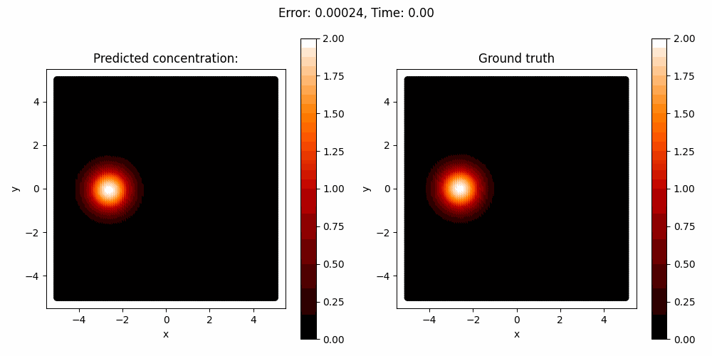

# PINN
A small project demonstrating the use of (Runge-Kutta) Physics-Informed Neural Networks (PINNs) in solving partial differential equations.

## Setup
To set up the project, follow these steps:

1. Clone the repository:
    ```sh
    git clone <repository-url>
    cd <repository-directory>
    ```

2. Install the required dependencies:
    ```sh
    pip install -r requirements.txt
    ```

3. Run the training script:
    ```sh
    python ADERKtrain.py -h
    ```

4. Run the testing script:
    ```sh
    python ADERKtest.py -h
    ```

## Results
Here is a sample output of the model for simulating a solution for an advection-diffusion scenario:

